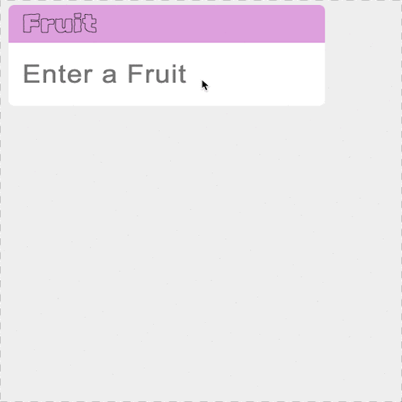

# Vanilla JavaScript AutoComplete Implementation

- leaning key points
  - promise for fake delay data response
  - debounce
  - intersection observer to detect element vision
  - click outside detect

## Scrollable

- event binding ( keyup / click / input )
- api contains

## Scrollable

- intersection observer

